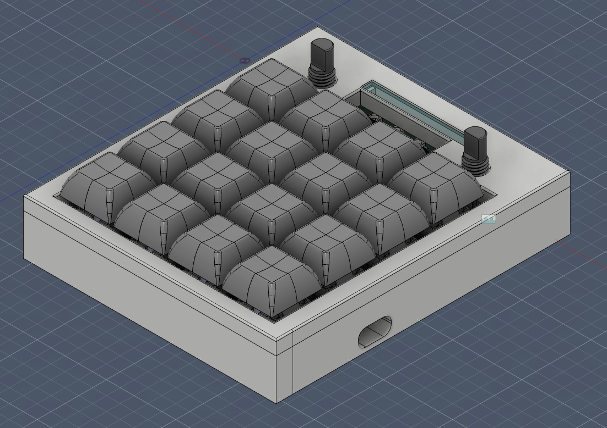
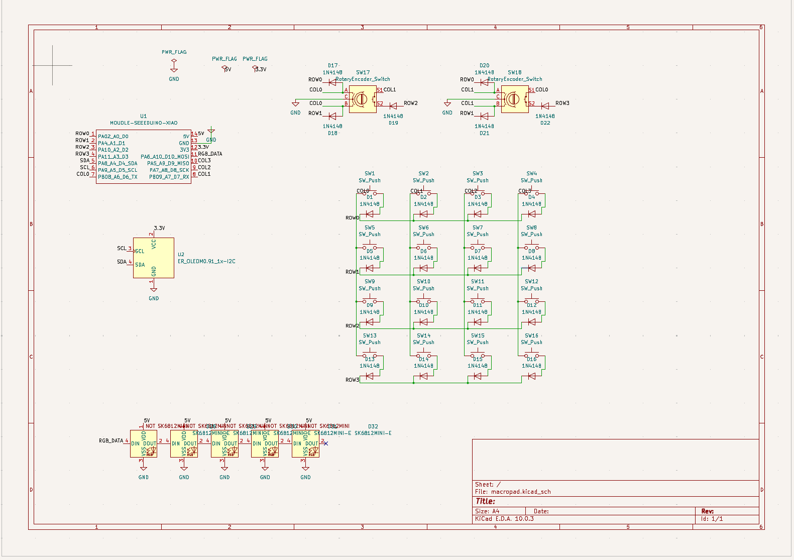
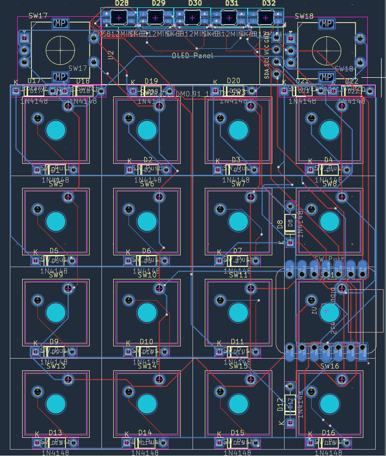

# vipad
vipad is a 4x4 macropad powered by vial firmware

It also has 2 encoders (knobs), oled screen and rgb leds

Overall render:

Schematics:

PCB:

Bill of materials:
- 1 custom pcb
- 16 MX-style mechanical switches
- 16 Blank DSA keycaps
- 2 EC11 rotary encoders
- 1 0.91” 128×32 OLED display
- 1 case (top and bottom)
- 1 Seeed XIAO RP2040
- 22 1N4148 diodes
- 5 SK6812 MINI-E RGB LEDs
- 6 M3×16mm screws
- 6 M3×5×4mm heatset inserts